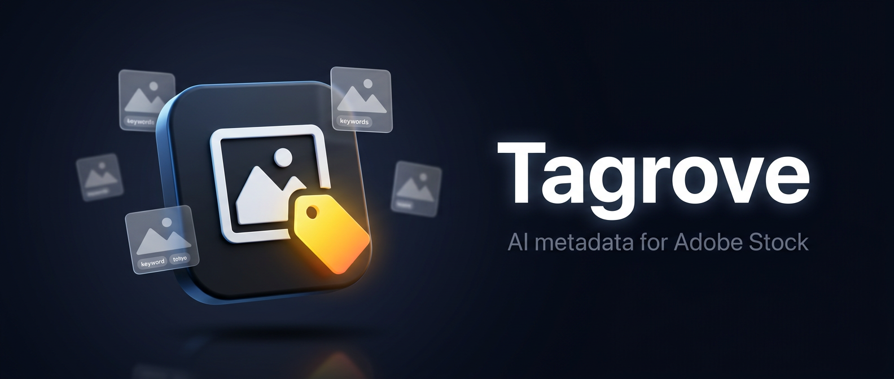

<div align="center">



<p>
  
  
  
  
  
  
  
</p>

**Tagrove turns a folder of images into Adobe Stock–ready metadata.** Import them,
generate titles, keywords and categories with Gemini, review every row inline, and
export a CSV that uploads cleanly — with your API key encrypted on your machine and
nothing sent anywhere except the model you chose.


</div>

---

## Contents

- [Highlights](#highlights)
- [Workflow](#workflow)
- [Features](#features)
- [Requirements](#requirements)
- [Quick start](#quick-start)
- [Try it with 5 sample images](#try-it-with-5-sample-images)
- [Building the installer](#building-the-installer)
- [Scripts](#scripts)
- [Tech stack](#tech-stack)
- [Project structure](#project-structure)
- [Documentation](#documentation)
- [Known limitations](#known-limitations)
- [License](#license)

## Highlights

| Capability              | What you get                                                                                                      |
| ----------------------- | ----------------------------------------------------------------------------------------------------------------- |
| AI generation           | Titles, keyword sets and categories per image via Gemini, with presets that shape the prompt and post-processing. |
| Review before export    | Inline editing with autosave, undo, bulk edits, search, filters and keyboard shortcuts.                           |
| Adobe Stock CSV         | Exact column order (`Filename, Title, Keywords, Category, Releases`) plus encoding and naming options.            |
| Auto-update             | Updates from GitHub Releases with stable/beta channels and differential downloads.                                |
| User-data safety        | The database is backed up before any migration runs, so a failed update never costs you work.                     |
| Privacy by default      | No telemetry, no accounts. Crash reporting is opt-in and scrubbed of paths, keys and images.                      |
| Built for real catalogs | 1000-image batches stay responsive; heavy pages load lazily and requests run in controlled parallel batches.      |

## Workflow



_Loops every 8 seconds: three files land in the table, Gemini fills the rows one by one
(pending → generating → done), the keywords appear, and the CSV exports._

1. **Import** — pick files or drag them in; content hashes flag duplicates.
2. **Generate** — choose a preset and run the batch; per-row status and progress track the run.
3. **Review** — fix titles and keywords inline, pick categories, bulk-edit, undo with `Ctrl+Z`.
4. **Export** — write the Adobe Stock CSV; rows that look off raise a warning first.

## Features

### Generation

- Gemini-powered titles, keywords and categories, with configurable model (default
  `gemini-2.5-flash`), parallel request count, image size and retry policy
- Four built-in presets (Photo, Illustration, 3D, Vector) plus your own custom presets
- Live progress bar, per-row status chips, **Cancel** mid-run, and **Retry failed**
- Banned-word filtering and category assignment from a locally editable category list

### Review & editing

- Inline editing of every field, autosaved — restart the app and your edits are still there
- Undo (`Ctrl+Z`), multi-select bulk actions (add/remove keyword, find & replace)
- Search box, status filters, and keyboard shortcuts for the common moves
- Missing-file state with relink, and content-hash duplicate detection on import

### Export

- Adobe Stock CSV with the exact column set and separator behaviour
- Filename/encoding options, plus the AI-generated marker in the Releases column
- Warning modal for rows that are too short, over-long, or missing a category

### Projects & data

- Every batch is a project in History: open, rename, duplicate, re-export, delete
- The active project is restored on launch; SQLite at `%APPDATA%/Tagrove/tagrove.db`
- Database backup before migrations, and config export/import for moving machines

### Updates & distribution

- Update check on launch and on demand from **Settings → Updates**
- Non-intrusive banner with **Restart and update** / **Later** — it never restarts itself
- Stable and beta channels; differential downloads via blockmaps
- Assisted NSIS installer: per-user by default, per-machine optional, custom folder,
  shortcuts, and an uninstaller that leaves your data in `%APPDATA%/Tagrove` alone

### Settings & experience

- Sections: API (with **Test connection** and latency), Generation, Export,
  Appearance (dark/light/system), Language, Privacy, Updates, Data
- English and a Bengali starter locale
- Splash screen before the bundle loads; History, Settings and About are lazy-loaded

### Reliability

- Opt-in crash reporting, scrubbed before it leaves the process — no images, API keys
  or file paths
- "Copy diagnostics" in About puts a redacted, clipboard-ready report on your machine
- Rotating log file at `%APPDATA%/Tagrove/logs/tagrove.log`

## Requirements

- Windows 10/11 (x64)
- Node.js **22 LTS** (anything ≥ 20.19 works; check with `node -v`)
- npm 10+ (ships with Node)
- A Google Gemini API key for generation — get one from [Google AI Studio](https://aistudio.google.com/)

## Quick start

```powershell
# 1. Install dependencies (first run downloads the Electron binary, ~2 min)
npm install

# 2. Start the app in development (Vite + HMR + Electron)
npm run dev
```

If the Electron binary download fails behind a proxy or mirror, set the mirror first:

```powershell
$env:ELECTRON_MIRROR = "https://npmmirror.com/mirrors/electron/"
npm install
```

> **On the database:** better-sqlite3 v13 ships Node-API prebuilds that load in both
> Electron and Node, so no `install-app-deps` rebuild is needed. The database is created
> and migrated automatically on first launch.

**Coming from StockMeta (≤ 0.3.0)?** Your data moves with you. On first launch Tagrove
copies the former `%APPDATA%/StockMeta` folder (database, settings, secrets, logs) into
`%APPDATA%/Tagrove`, verifies the copy, and renames the database to `tagrove.db`. The old
folder is kept untouched as a backup. If the saved API key cannot be decrypted afterwards,
the app asks you to re-enter it in Settings.

## Try it with 5 sample images

```powershell
node scripts/generate-samples.mjs
```

That writes five colourful test images into `samples/` (git-ignored). Then:

1. `npm run dev` to start the app.
2. **Settings → API** — paste your Gemini API key, **Save key**, then **Test connection**
   (shows latency or a friendly error). Pick a model, parallel-request count, image size
   and retries; **Save preferences**.
3. **Generate → Import images** — select the five files from `samples/`, or drag and drop
   them. Importing the same files again warns about content duplicates.
4. Pick a **preset** (e.g. "Photo"), then **Generate all** — per-row status chips and the
   progress bar track the run; **Cancel** stops it; **Retry failed** retries.
5. Edit titles and keywords inline (autosaved), pick categories, `Ctrl+Z` to undo, select
   rows for **bulk actions**, and use the **search box / filters**.
6. **Export CSV** — choose a location; rows with issues trigger a warning modal first.
7. **History** — the batch is saved as a project: open, rename, duplicate, re-export or
   delete it; the active project returns on next launch.

Without an API key, generation fails per row with a friendly "No Gemini API key is
configured" message — the rest of the pipeline works regardless.

## Building the installer

```powershell
npm run dist
```

Produces `release/Tagrove-<version>-x64-Setup.exe`, its `.blockmap` (for differential
updates) and `release/latest.yml` (the feed the updater reads). Use `npm run dist:dir` for
a fast unpacked build when you only need to sanity-check packaging.

Code signing is environment-driven, so no certificate or password is ever committed. With
signing configured, the installer is signed; without it the build still succeeds and is
simply unsigned, which means SmartScreen may warn on first run. See
[RELEASING.md](./RELEASING.md) for the PFX and Azure Trusted Signing options, their costs,
and the full release procedure.

Releases run through GitHub Actions: `.github/workflows/ci.yml` verifies every push and
pull request, and `.github/workflows/release.yml` builds and publishes on a `v*.*.*` tag.

## Scripts

| Script                                           | What it does                                                     |
| ------------------------------------------------ | ---------------------------------------------------------------- |
| `npm run dev`                                    | Dev mode: Vite dev server + Electron with HMR                    |
| `npm run build`                                  | Production build of main/preload/renderer into `out/`            |
| `npm run typecheck`                              | Strict TypeScript check                                          |
| `npm run lint`                                   | ESLint                                                           |
| `npm run format`                                 | Prettier (write); `format:check` for CI                          |
| `npm test`                                       | Vitest unit tests (single run); `test:watch` for watch mode      |
| `npm run verify`                                 | typecheck + lint + test + build — run before every commit        |
| `npm run dist`                                   | Build the Windows installer: `release/Tagrove-<v>-x64-Setup.exe` |
| `npm run dist:dir`                               | Build an unpacked app folder (fast packaging sanity check)       |
| `node scripts/generate-icons.mjs`                | Regenerate `resources/icon.ico` from `icon.png`                  |
| `node scripts/generate-samples.mjs --count 1000` | Perf-test images into `samples/perf/`                            |

## Tech stack

| Layer      | Choice                                                            |
| ---------- | ----------------------------------------------------------------- |
| Shell      | Electron 44, electron-vite 5                                      |
| UI         | React 18, Tailwind CSS v4, Zustand, i18next                       |
| Language   | TypeScript 5.9 in strict mode                                     |
| Data       | better-sqlite3 13 (SQLite), transactional forward-only migrations |
| Validation | zod — every IPC payload crossing the process boundary             |
| AI         | `@google/genai` (Gemini)                                          |
| Updates    | electron-updater + electron-builder (NSIS)                        |
| Quality    | Vitest (143 tests), ESLint 10, Prettier 3                         |

## Project structure

```
src/main       Electron main process: lifecycle, window, security, IPC handlers, services, SQLite
src/preload    The single typed contextBridge (window.api)
src/renderer   React UI: pages, components, stores, hooks, i18n locales, Tailwind theme
src/shared     IPC contract (channels + zod schemas + types), constants, validation, editable lists
resources/     App icon (png + ico)
scripts/       Icon regeneration, sample generation, release-note extraction
docs/assets/   README artwork: 3D banner + looping SVG animations
.github/       CI and Release workflows
samples/       Generated test images (git-ignored)
legacy-wpf/    Archived C#/WPF implementation of the same product (reference only)
```

## Documentation

| Document                             | What is in it                                                                                          |
| ------------------------------------ | ------------------------------------------------------------------------------------------------------ |
| [ARCHITECTURE.md](./ARCHITECTURE.md) | Process model, security rules, IPC contract, data layer and migration rules, and how to add a feature. |
| [RELEASING.md](./RELEASING.md)       | Cutting a release: versioning, tagging, signing, publishing, update-path testing, checklist.           |
| [PRIVACY.md](./PRIVACY.md)           | What is stored locally and exactly what (if anything) leaves your machine.                             |
| [CHANGELOG.md](./CHANGELOG.md)       | Release history.                                                                                       |

## Known limitations

<details>
<summary><b>Read before trusting every column</b></summary>

- The category IDs in `src/shared/categories.json` are **placeholders**; replace them with
  the official Adobe Stock IDs (see the TODO note in the file) before trusting the Category
  column. Restart the app after editing `categories.json` or `bannedWords.json`.
- The AI-generated marker writes `ai-generated` into the Releases column — adjust the
  `EXPORT.AI_RELEASES_MARKER` constant if Adobe's current workflow needs a different value.
- Bengali (`bn`) is a starter locale; untranslated strings fall back to English.
- Cancelling a run still counts an in-flight request that already finished.
- Until code signing is configured, the installer is unsigned (SmartScreen warning); see
  [RELEASING.md](./RELEASING.md) for signing options.

</details>

## License

Proprietary — `UNLICENSED`, all rights reserved (see `package.json`).
